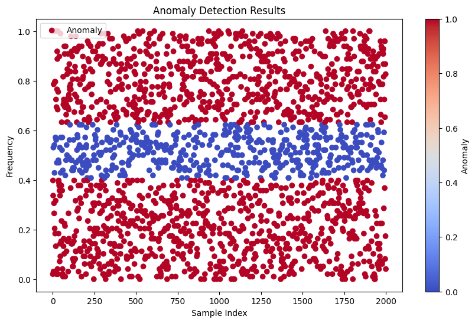
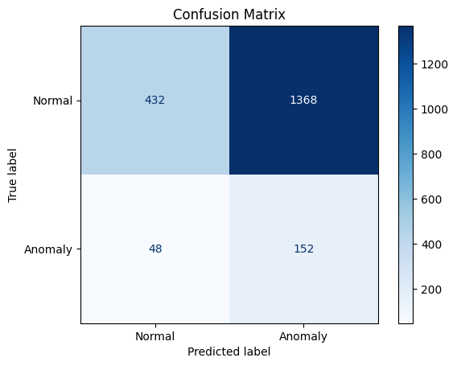
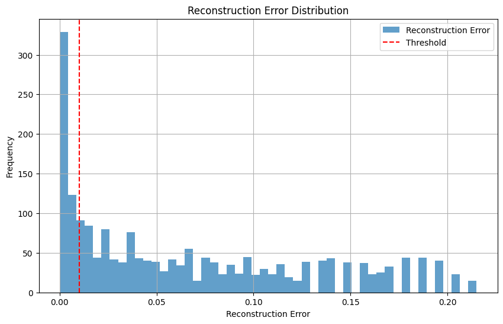

# CAN Data Anomaly Detection Pipeline with Deep Autoencoder

This repository implements a comprehensive pipeline for anomaly detection in Controller Area Network (CAN) data using a deep autoencoder. The project combines data preprocessing, synthetic data generation, deep learning, and performance evaluation, making it suitable for detecting anomalies in vehicle communication networks or other structured data.

---

## Features

1. **Standard Dataset Loading**:
   - Reads a structured Excel dataset containing `CAN_ID` and `Frequency (Hz)` columns.
   - Ensures column integrity and standardizes naming conventions.

2. **Synthetic Data Generation**:
   - Creates random synthetic CAN data for testing and experimentation.
   - Generates up to 10,000 samples with randomly assigned `CAN_ID` and frequencies.

3. **Dynamic Dataset Selection**:
   - Automatically compares the size of the generated and standard datasets.
   - Selects the most appropriate dataset for further processing.

4. **Data Preprocessing**:
   - Converts hexadecimal `CAN_ID` values to integers.
   - Scales frequency values using `MinMaxScaler` for optimal input into the neural network.

5. **Deep Autoencoder**:
   - Implements a multi-layer autoencoder using PyTorch for unsupervised learning.
   - Encodes and reconstructs frequency data, minimizing reconstruction loss.

6. **Training Pipeline**:
   - Trains the autoencoder with Mean Squared Error (MSE) loss.
   - Supports adjustable training epochs and learning rate.

7. **Anomaly Detection**:
   - Calculates reconstruction error to identify anomalies.
   - Provides a customizable threshold for anomaly detection.

8. **Visualization**:
   - Displays the reconstruction error distribution with anomaly thresholds.
   - Highlights detected anomalies using scatter plots.

9. **Performance Metrics**:
   - Evaluates model performance using precision, recall, and F1-score.
   - Displays confusion matrix for clear anomaly classification results.

---

## Dependencies

- **Python** (>=3.8)
- **Libraries**:
  - `numpy`
  - `pandas`
  - `torch` (PyTorch)
  - `scikit-learn`
  - `matplotlib`
  - `rich`
  - `openpyxl` (for Excel file handling)

Install dependencies with:
```bash
pip install -r requirements.txt
```


## Usage

### 1. Prepare the Dataset
- Place your standard dataset Excel file (e.g., `random_can_data.xlsx`) in the project directory.
- Ensure the dataset contains the required columns: `CAN_ID` and `Frequency (Hz)`.

### 2. Run the Pipeline
- Execute the main script by running the following command in your terminal:
  ```bash
  python main.py
  ```
## Output

### 1. Generated Visualizations
The script produces the following visualizations to aid in interpreting the results:

- **Reconstruction Error Distribution**:
  - Displays the distribution of reconstruction errors.
  - Highlights the threshold used to classify anomalies.
  - Example:
    

- **Anomaly Detection Scatter Plot**:
  - Differentiates between normal and anomalous samples.
  - Normal data points are shown in blue, while anomalies are highlighted in red.
  - Example:
    

### 2. Console Metrics
Key performance metrics and a confusion matrix are displayed in the console:

- **Performance Metrics**:
  - Precision: Indicates the proportion of correctly identified anomalies among all detected anomalies.
  - Recall: Measures the proportion of true anomalies correctly identified.
  - F1-Score: The harmonic mean of precision and recall.

  Example Output:



  
- **Confusion Matrix**:
- Provides a detailed view of the classification results, showing true positives, false positives, true negatives, and false negatives.

Example:



### 3. Refinement with Threshold Adjustment
- Adjust the anomaly detection threshold in the `detect_anomalies` function to fine-tune results:
```python
threshold = 0.01  # Adjust this value to refine anomaly detection
```


